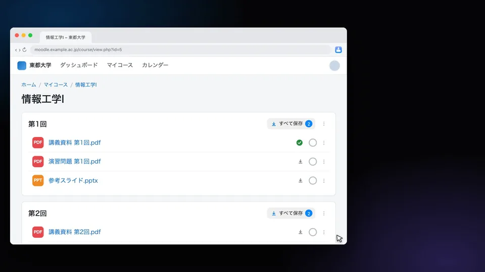
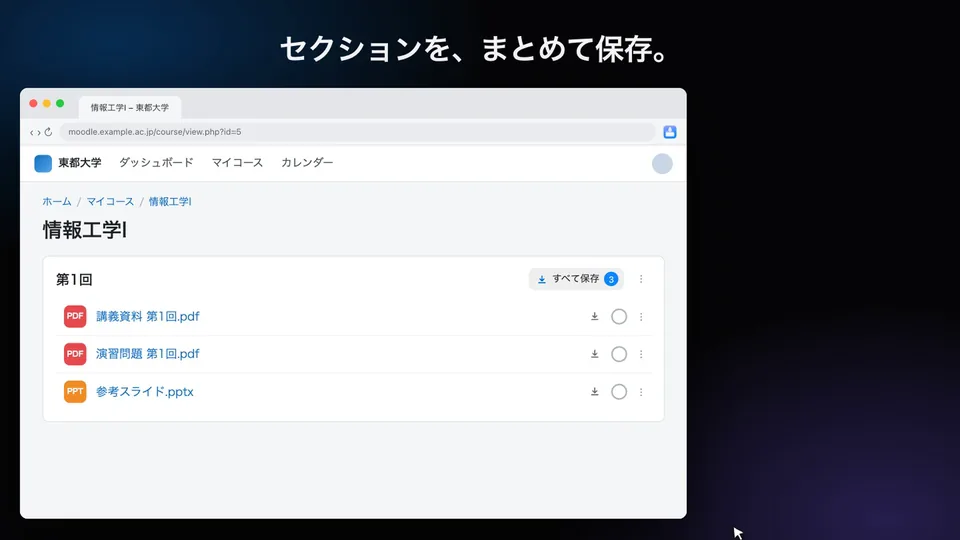
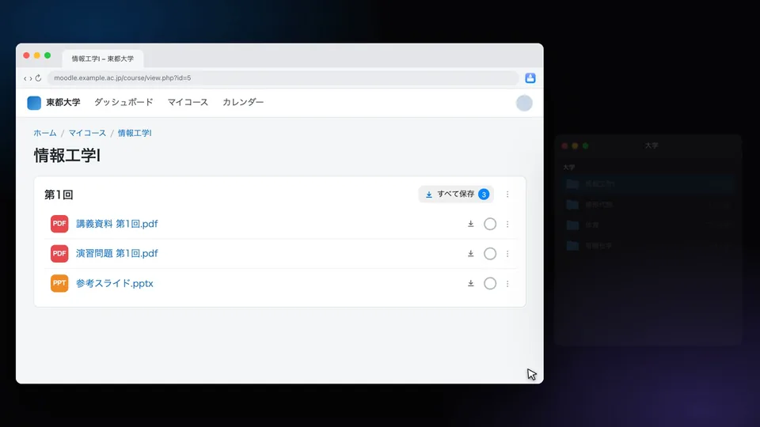
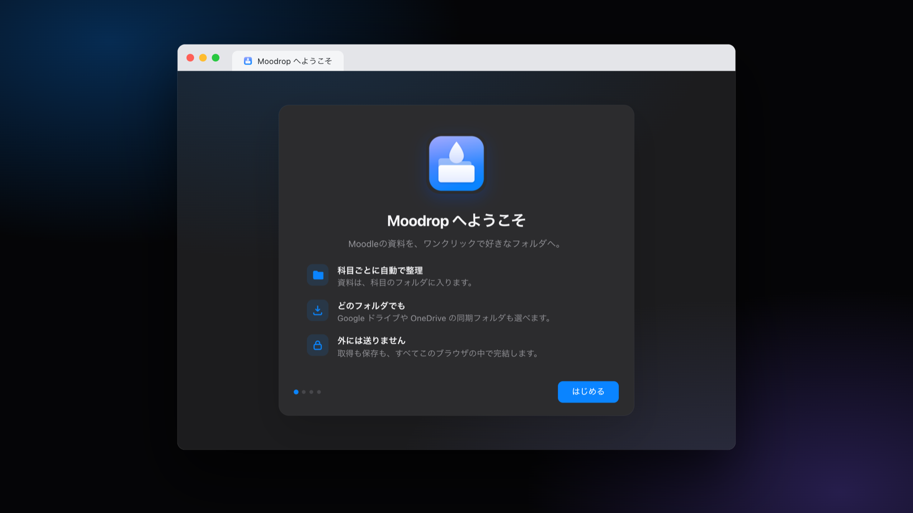
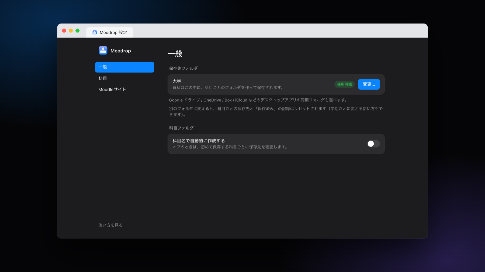
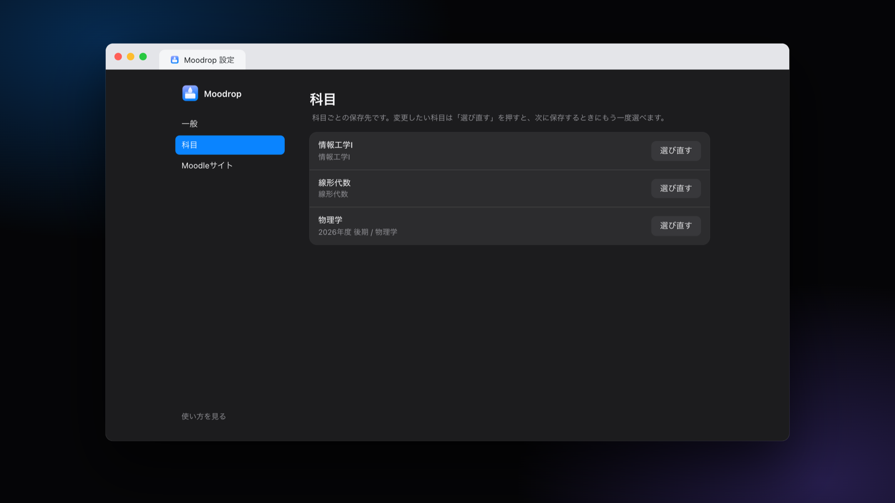
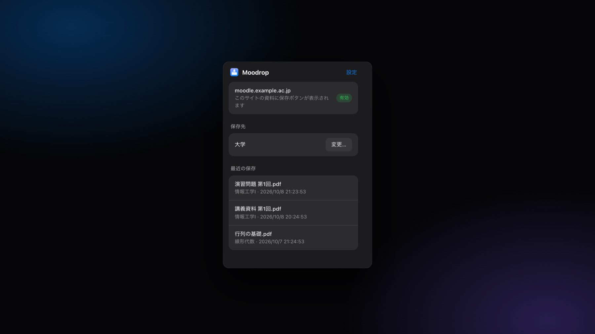

<div align="center">


# Moodrop

**Moodleの資料を、ワンクリックで好きなフォルダへ。**

Moodleの資料の横に保存ボタンを置いて、パソコンの科目ごとのフォルダに保存する、小さなChrome拡張機能です。<br>
アカウントも、クラウドAPIの設定も要りません。取得も保存も、すべてブラウザの中で完結します。

[](#動作環境)
[](LICENSE)

[ウェブサイト](https://haruhito767676.github.io/moodrop/ja/) · [English](README.md) · [プライバシー](PRIVACY.md)

</div>

<br>

> **状況:** Moodropは開発中で、まだChromeウェブストアには公開していません。当面は[ソースから導入](#導入)してください。

> Moodropは非公式のツールで、Moodle Pty Ltd とは関係ありません。「Moodle」は Moodle Pty Ltd の商標です。

<p align="center"></p>
<p align="center"><sub>38秒のデモを見る: <a href="docs/media/demo-ja.mp4">demo-ja.mp4</a></sub></p>

---

## できること

### ポインタを乗せて、押すだけ

Moodleの科目ページの資料の右端に、控えめなアイコンが出ます。行にポインタを乗せると**保存**ボタンになり、1クリックでフォルダに入ります。保存した資料には緑のチェックが付きます。

### セクションを、まとめて保存

セクション見出しに、件数つきの**すべて保存**ボタンが付きます。実行中はボタンが進捗バーになり、失敗したものだけ再試行できます。

<p align="center"></p>

### 保存先は、最初に選ぶだけ

資料は `選んだフォルダ/科目名/…` に入ります。ある科目で初めて保存するときに、既存のフォルダ（名前が近いものを提案します）を選ぶか、新しく作ります。次からは、その科目の資料は何も聞かずに同じ場所へ。科目名で自動的に作る設定もあります。

<p align="center"></p>

### そのほか

- **どのフォルダでも、クラウドの同期フォルダでも。** Google ドライブ、OneDrive、Box、iCloud の同期フォルダを選べば、そのまま使えます。パソコン上のフォルダに書くだけなので、APIキーもログインも要りません。
- **保存済みが分かる。** ファイルを消すと、緑のチェックも消えます。
- **同名のファイルにも対応。** 同じ名前があれば、**別名で保存**か**上書き**を選べます。一括保存では、残りにも同じ操作を適用できます。
- **あなたのMoodleで使える。** 特定の学校に固定されません。使うMoodleサイトを、自分で有効にします。
- **プライバシー重視の設計。** 資料はMoodleから、あなたのフォルダへ直接入ります。詳しくは[プライバシー](PRIVACY.md)をご覧ください。
- **日本語と英語。** ブラウザの言語に合わせて切り替わります。

### 画面

<table>
<tr>
<td width="50%"></td>
<td width="50%"></td>
</tr>
<tr>
<td align="center"><sub>案内が、準備を順番に導きます</sub></td>
<td align="center"><sub>設定</sub></td>
</tr>
<tr>
<td width="50%"></td>
<td width="50%"></td>
</tr>
<tr>
<td align="center"><sub>科目ごとの保存先</sub></td>
<td align="center"><sub>ツールバーのポップアップ</sub></td>
</tr>
</table>

## 導入

Moodropはまだウェブストアにないので、「パッケージ化されていない拡張機能」として読み込みます。

1. このリポジトリをダウンロード（**Code → Download ZIP** して解凍）するか、クローンします。
2. `chrome://extensions` を開いて、**デベロッパー モード**をオンにします。
3. **パッケージ化されていない拡張機能を読み込む**を押して、`manifest.json` があるフォルダを選びます。
4. 案内のページが開きます。保存先のフォルダを選び、使うMoodleのURLを入れれば、準備完了です。

**フォルダは、置いた場所から動かさないでください。** Chromeは、選んだフォルダから直接Moodropを読み込むので、フォルダを削除すると拡張機能も消えます。動かす必要があるときは、新しい場所から読み込み直してください（設定は残ります）。

更新するときは、そのフォルダの中身を新しいバージョンに置き換えて（または `git pull` して）、拡張機能のカードにある再読み込み（↻）ボタンを押します。設定は残ります（拡張機能を削除すると、設定も消えます）。

### 動作環境

| 項目 | 内容 |
|---|---|
| ブラウザ | Chrome 111 以降。File System Access API に対応した他のChromium系ブラウザ（Edge、Braveなど）でも動くはずですが、確認はしていません。 |
| Moodle | ブラウザでログインして使えるMoodleサイト。テーマやバージョンによって画面の作りが違うため、うまく表示されないレイアウトがあるかもしれません。ご報告をお待ちしています。 |

## 使い方

1. Moodleの科目ページを開きます。
2. 資料にポインタを乗せて**保存**を押すか、セクション見出しの**すべて保存**を押します。
3. 科目で初めて保存するときは、保存先を選びます。次回からは、覚えています。

保存先のフォルダの変更、Moodleサイトの管理、科目ごとの保存先のリセットは、設定ページでできます（ツールバーのアイコン →「設定」）。

### 注意

- ブラウザを再起動すると、Chromeが保存先フォルダへのアクセスをもう一度確認します。Moodropが案内を出します。Chromeのダイアログで「サイトを開くたびに許可」を選ぶと、次回から確認されません。
- Chromeは、ホームフォルダやダウンロードフォルダそのものなど、いくつかのフォルダを選ばせてくれません。その場合は、その中のサブフォルダを選ぶか、作ってください。
- 保存できるのは、Moodleがファイルとして配信している資料（資料、フォルダの中身、課題の添付など）です。ストリーミング動画は対象外です。
- 保存先を別のフォルダに変えると、科目ごとの保存先と「保存済み」の記録がリセットされます（ファイルには手を付けません）。

## 権限

Moodropは、必要最小限の権限しか求めません。

| 権限 | 用途 |
|---|---|
| `storage` | 設定、科目ごとの保存先、保存した資料の記録を覚えます。 |
| `scripting` | 有効にしたMoodleサイトに、保存ボタンを表示します。 |
| `activeTab` | ツールバーのポップアップで、いま見ているタブがMoodleかどうかを調べます。 |
| **あなたが追加したサイト**へのアクセス（任意） | Moodleサイトを有効にするたびに、Chromeがサイトごとに確認します。Moodropが読み取り・ダウンロードできるのは、そのサイトだけです。設定でいつでも解除できます。 |

## プライバシー

Moodropには、サーバーも、アカウントも、アクセス解析も、広告もありません。あなた自身のログイン状態でMoodleから資料を取得し、選んだフォルダに書き込みます。詳細は[PRIVACY.md](PRIVACY.md)をご覧ください。

## 開発

```bash
npm test      # ユニットテスト（ファイル名、Moodleの解析、ファイル書き込み、翻訳）
```

ビルドは要りません。リポジトリのフォルダを「パッケージ化されていない拡張機能」として読み込み、変更したら再読み込みしてください。

```
manifest.json
_locales/      文言（en, ja）
src/
  background.js    サービスワーカー: 資料を取得して、フォルダに書き込む
  content/         Moodleのページに出す保存ボタンとダイアログ（Shadow DOM）
  lib/             ファイル名、Moodleからの取得、フォルダへの書き込み、保存、サイト
  welcome/ options/ popup/ grant/    拡張機能自身のページ
test/
```

文言は `_locales/<言語>/messages.json` にあります。言語を足すには、`en` をコピーして翻訳し、`npm test` を実行してください（キーとプレースホルダがすべて一致しているか、テストが確かめます）。

## ライセンス

[MIT](LICENSE)
