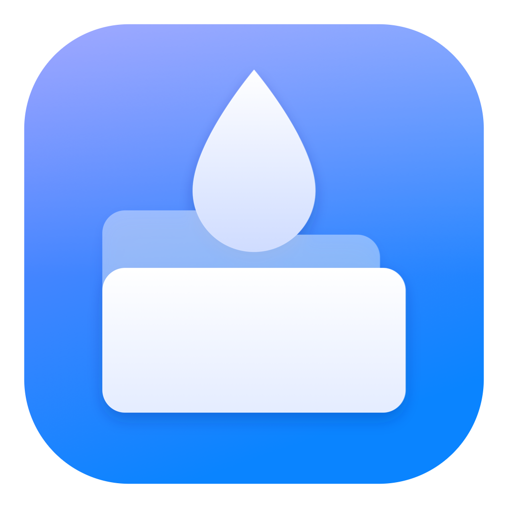
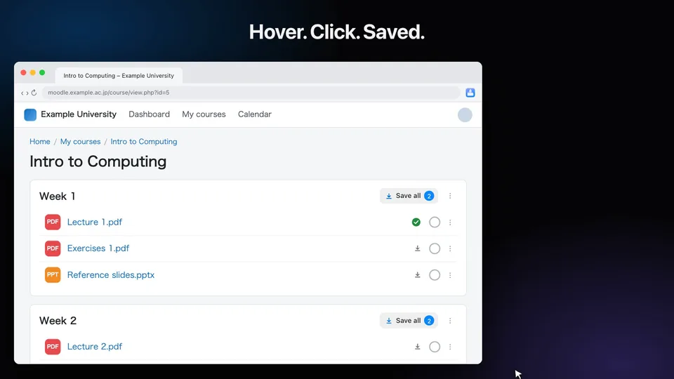
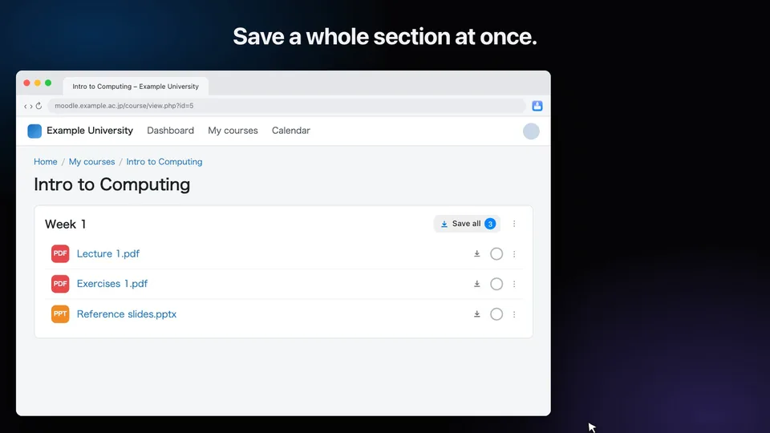
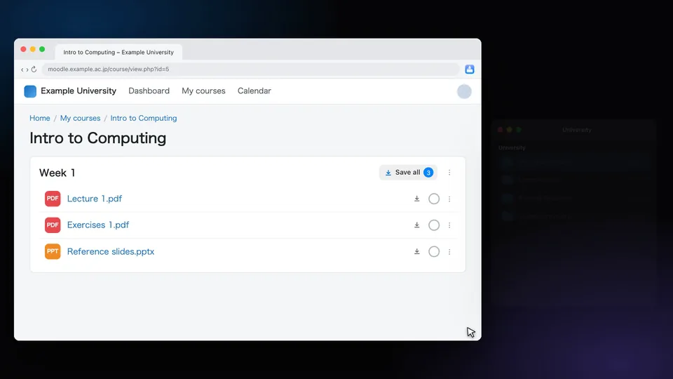
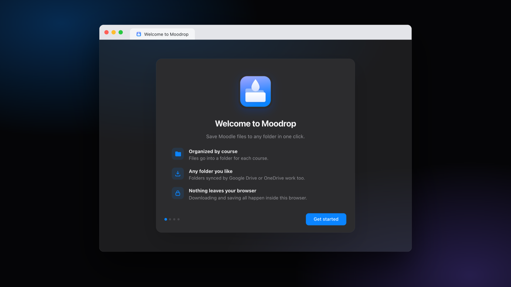
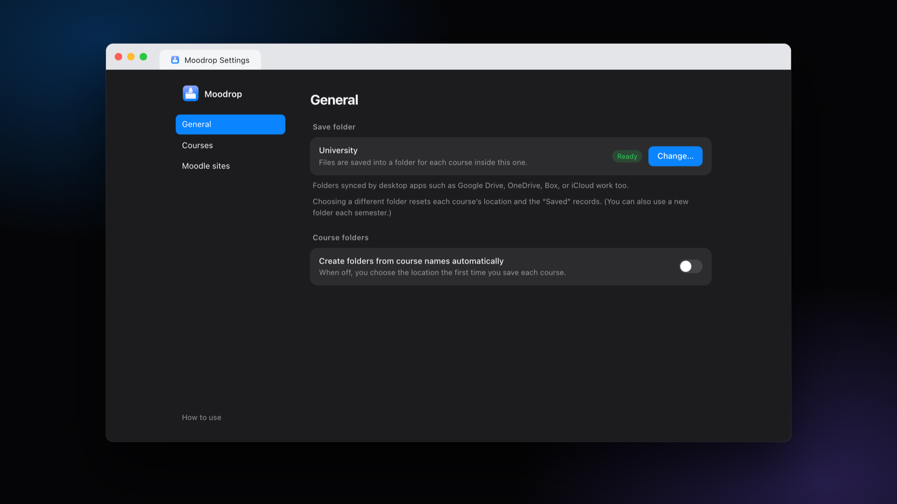
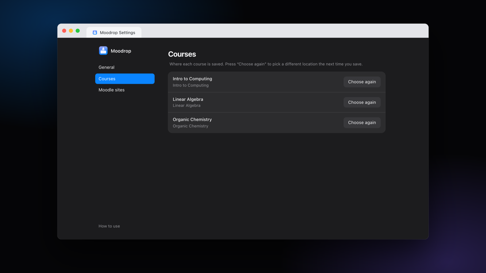
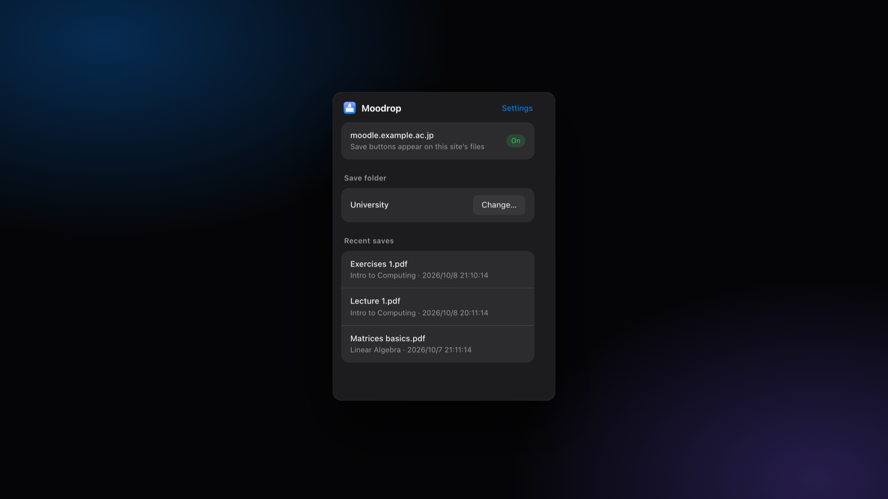

<div align="center">



# Moodrop

**Save Moodle course files to any folder with one click.**

A small Chrome extension that puts a save button next to the files in Moodle and drops them into per-course folders on your computer.<br>
No accounts, no cloud API setup, and nothing leaves your browser.

[](#requirements)
[](LICENSE)

[Website](https://haruhito767676.github.io/moodrop/) · [日本語](README.ja.md) · [Privacy](PRIVACY.md)

</div>

<br>

> **Status:** Moodrop is in active development and is not on the Chrome Web Store yet. For now, [install it from source](#install).

> Moodrop is an unofficial tool and is not affiliated with Moodle Pty Ltd. "Moodle" is a trademark of Moodle Pty Ltd.

<p align="center"></p>
<p align="center"><sub>Watch the 38-second demo: <a href="docs/media/demo-en.mp4">demo-en.mp4</a></sub></p>

---

## What Moodrop does

### Hover. Click. Saved.

A quiet icon sits at the right edge of every file on a Moodle course page. Hover a row and it turns into a **Save** button. One click, and the file is in your folder. Files you already saved get a green check.

### Save a whole section

Each section header gets a **Save all** button with a counter. While it runs, the button becomes a progress bar; if anything fails, you can retry just those files.

<p align="center"></p>

### Pick a folder once

Files go into `<your folder>/<course>/…`. The first time you save from a course, choose an existing folder (Moodrop suggests the one with a similar name) or create a new one. After that, every file from that course goes to the same place with no questions asked. You can also let Moodrop name folders after your courses automatically.

<p align="center"></p>

### And more

- **Any folder, including cloud folders.** Pick a folder synced by Google Drive, OneDrive, Box, or iCloud and it just works. No API keys and no sign-in, because Moodrop only writes to a folder on your computer.
- **Knows what you already have.** If you delete a file, its green check goes away.
- **Duplicates handled.** If a file with the same name exists, choose **Keep both** or **Replace**, and apply the choice to the rest of a bulk save.
- **Works with your Moodle.** Not tied to one school. You enable it for the Moodle sites you use.
- **Private by design.** Files go from Moodle straight to your folder. See [Privacy](PRIVACY.md).
- **English and Japanese**, following your browser language.

### Screens

<table>
<tr>
<td width="50%"></td>
<td width="50%"></td>
</tr>
<tr>
<td align="center"><sub>A short welcome walks you through setup</sub></td>
<td align="center"><sub>Settings</sub></td>
</tr>
<tr>
<td width="50%"></td>
<td width="50%"></td>
</tr>
<tr>
<td align="center"><sub>Where each course is saved</sub></td>
<td align="center"><sub>The toolbar popup</sub></td>
</tr>
</table>

## Install

Moodrop is not on the Chrome Web Store yet, so load it as an unpacked extension:

1. Download this repository (**Code → Download ZIP**, then unzip it) or clone it.
2. Open `chrome://extensions` and turn on **Developer mode**.
3. Click **Load unpacked** and choose the folder that contains `manifest.json`.
4. A welcome page opens. Follow the three steps: choose a save folder, add your Moodle's URL, and you're ready.

To update, pull or download the new version and press the reload (↻) button on the extension's card. Your settings are kept. (Removing the extension clears them.)

### Requirements

| Item | Details |
|---|---|
| Browser | Chrome 111 or later. Other Chromium-based browsers that support the File System Access API (Edge, Brave, and so on) should work, but they have not been tested. |
| Moodle | Any Moodle site you can sign in to in your browser. Themes and versions differ, so a few layouts may need adjustments. Reports are welcome. |

## How to use

1. Open a course page in Moodle.
2. Hover a file and press **Save**, or press **Save all** at the top of a section.
3. The first time you save from a course, choose where it goes. Moodrop remembers it for next time.

You can change the save folder, manage your Moodle sites, and reset a course's folder in the settings page (click the toolbar icon, then **Settings**).

### Notes

- After you restart your browser, Chrome asks you to allow access to the save folder again. Moodrop shows a prompt for this. Choosing **Allow on every visit** in Chrome's dialog stops it from asking again.
- Chrome refuses a few folders, such as your home folder or the Downloads folder itself. If that happens, choose or create a subfolder inside it.
- Moodrop saves files that Moodle serves as files (resources, folder contents, assignment attachments). It does not download streamed video.
- If you change the save folder to a different one, the per-course locations and "Saved" marks are reset (your files are not touched).

## Permissions

Moodrop asks for as little as it can.

| Permission | Why |
|---|---|
| `storage` | Remembers your settings, the course-to-folder choices, and which files you saved. |
| `scripting` | Adds the save buttons to the Moodle sites you enabled. |
| `activeTab` | Lets the toolbar popup check whether the tab you are looking at is Moodle. |
| Optional access to **sites you add** | Chrome asks you for each Moodle site when you enable it. Moodrop can only read and download from those sites. You can remove a site any time in settings. |

## Privacy

Moodrop has no server, no account, no analytics, and no ads. It fetches files from your Moodle with your own signed-in session and writes them to the folder you chose. The details are in [PRIVACY.md](PRIVACY.md).

## Development

```bash
npm test      # unit tests (file naming, Moodle parsing, file writing, translations)
```

There is no build step. Load the repository folder as an unpacked extension and reload it after changes.

```
manifest.json
_locales/      Strings (en, ja)
src/
  background.js    Service worker: fetches files and writes them to the folder
  content/         The save buttons and dialogs shown on Moodle pages (Shadow DOM)
  lib/             File names, Moodle fetching, folder writing, storage, sites
  welcome/ options/ popup/ grant/    The extension's own pages
test/
```

Translations live in `_locales/<lang>/messages.json`. To add a language, copy `en`, translate the messages, and run `npm test`: the tests check that every key and placeholder matches.

## License

[MIT](LICENSE)
